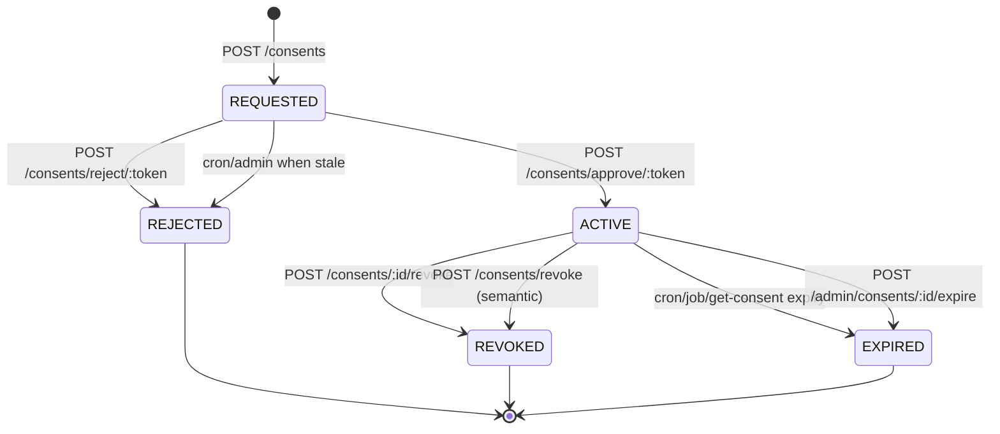

# Consent Lifecycle Flow
---
Artefact-ID: CMP-LC-CONSENT-LIFECYCLE
Title: Consent Lifecycle Flow
Version: 1.0
Status: ACTIVE
Effective-Date: 2026-02-02
Supersedes: (none)
Authoritative: true
Change-Control: ADR-0000
Source-Basis: backend/src/repositories/consentRepo.ts (REQUESTED/ACTIVE/REJECTED/REVOKED/EXPIRED states); regulatory_competitive_context_inputs/dpdp_summary.md (DPDP Section 6 lifecycle design principles); regulatory_competitive_context_inputs/negd_brd_summary.md
Traceability: [DPDP-S6-Rule-1] [DPDP-S6-Rule-4] [DPDP-S8-Rule-1]
Linked-Artefacts: artefacts/01_legal-conceptual/01-consent_taxonomy_authoritative.md; artefacts/01_legal-conceptual/04-processing_decision_matrix_authoritative.md; artefacts/03_system-model/09-consent_state_machine_spec_authoritative.md; artefacts/02_risk-accountability/05_audit-logging/05-2-audit_event_catalog_authoritative.md; artefacts/04_execution-layer/13_sops/13-2-sop_withdraw_consent_authoritative.md
Review-Cadence: Semiannual
Owner: TBD
---

## Cross-Links
- State machine → audit → SOP chain:
   - → Ref: 09-consent_state_machine_spec_authoritative.md (allowed transitions)
   - → Ref: 05-2-audit_event_catalog_authoritative.md (lifecycle events)
   - → Ref: 13-2-sop_withdraw_consent_authoritative.md (withdrawal execution)
- Consent artefact schema:
   - → Ref: consent_artefact_schema.json field:status
   - → Ref: consent_artefact_schema.json field:revoked_at
   - → Ref: consent_artefact_schema.json field:expires_at

## Purpose
Describe the operational lifecycle currently implemented for consent records, including when new versions are created and how state transitions occur.

## Regulatory Foundation (DPDP Act)
Under Section 6(1) of the DPDP Act, 2023, a Data Principal has the right to:
- **Give** consent — explicit, informed affirmative action
- **Manage** consent — granular withdrawal capability
- **Withdraw** consent — with ease equivalent to giving it

This artefact operationalizes these statutory rights through a five-state model (`REQUESTED`, `ACTIVE`, `REJECTED`, `REVOKED`, `EXPIRED`) that ensures:
1. **No implicit consent** — `REQUESTED` state ensures notice and opt-in before activation
2. **Withdrawal parity** — revoke endpoints mirror consent-giving simplicity
3. **Temporal accountability** — expiry and timestamps are non-negotiable audit anchors
4. **Version auditability** — all versions remain accessible for forensic review

## Core Design Principles
- **Event-driven**: Every state transition is triggered by an explicit event (user action or system rule)
- **Withdrawal is terminal**: Once `REVOKED` or `EXPIRED`, a new consent request must be issued; no auto-renewal
- **Processing is gated**: State alone does not permit processing; matching of purpose and data scope is required (see Processing Decision Matrix)
- **Audit is immutable**: Every transition emits an audit event; audit records cannot be modified or deleted

## Lifecycle Summary (Implemented)
1. **Create** (`POST /consents`) creates a new version in `REQUESTED`.
2. **Approve** (`POST /consents/approve/:token`) transitions that version to `ACTIVE` and consumes the token.
   - Also revokes any existing `ACTIVE` consent in the same `consent_group_id`.
   - Rejects any other `REQUESTED` consents in that group.
3. **Reject** (`POST /consents/reject/:token`) transitions that version to `REJECTED` and consumes the token.
4. **Withdraw/Revoke**
   - Version-specific: `POST /consents/:id/revoke` transitions `ACTIVE → REVOKED`.
   - Semantic: `POST /consents/revoke` finds latest `ACTIVE` for `(userId,purpose)` then transitions `ACTIVE → REVOKED`.
5. **Expire**
   - Scheduled cron updates set `ACTIVE → EXPIRED` and stale `REQUESTED → REJECTED` when `valid_until < NOW()`.
   - The `expireDueConsents()` job also expires `ACTIVE` consents and emits audits.
   - `GET /consents/:id` attempts expiry before returning the record.
6. **Admin forced expiry/rejection** (`POST /admin/consents/:id/expire`)
   - If `ACTIVE`, force `EXPIRED`.
   - If `REQUESTED`, force `REJECTED`.
   - Otherwise idempotent.

## State Machine (Mermaid)

## Versioning & Supersession Rules
- Each `POST /consents` creates a new version in the group `{userId}:{purpose}`.
- Approval of a version revokes any previously active version in the group.
- Historical versions remain queryable by `GET /consents/:id`.

## Audit Emission (Implemented)
- `CONSENT_REQUESTED` on creation.
- `CONSENT_APPROVED` / `CONSENT_REJECTED` on token flows.
- `CONSENT_REVOKED` on revoke flows.
- `CONSENT_EXPIRED` emitted by:
  - `GET /consents/:id` when it performs an expiry update
  - `expireDueConsents()` job
  - (Cron expiry currently updates rows but does not emit audit entries.)

## Compliance Mapping Notes
- “Withdrawal must be as easy as giving consent”: implemented as revoke endpoints.
- Real-time validation: implemented as `/process`.

## Forbidden Transitions (Explicit)
The following transitions are treated as illegal in this implementation model:
- `REVOKED → ACTIVE` (requires a new consent request/version)
- `EXPIRED → ACTIVE` (requires a new consent request/version)
- Any consent lifecycle change triggered by `/process` evaluation (see processing decision matrix)

## Forward Model — Not Implemented in MVP

The following lifecycle enhancements are normative requirements from DPDP / NeGD but are not yet implemented:

### Consent Update (without Withdrawal)
- **Scope**: Scope expansion, purpose refinement, or duration extension
- **Rule**: Any expansion of data scope or purpose requires fresh consent; narrowing may allow update-in-place with audit trail
- **MVP Status**: Not implemented; all changes trigger new consent request

### Renewal / Re-notification
- **Scope**: Periodic re-confirmation of active consent (e.g., yearly renewal)
- **Rule**: Renewal notices must be easy to respond to; expiry should trigger renewal prompts
- **MVP Status**: Not implemented; expiry is final

### Purpose Splitting (Granular Withdrawal)
- **Scope**: Multi-purpose consent that can be partially withdrawn
- **Rule**: Each purpose must be independently revocable; withdrawal of one purpose does not terminate others
- **Current Model**: Single-purpose per consent record (consent_group_id = {userId}:{purpose})
- **MVP Status**: Single-purpose only; multi-purpose requires architectural change

### Consent Audit Export
- **Scope**: Data Principal access to complete consent audit trail (7-year retention as per DPDP Sect. 8)
- **Rule**: Machine-readable export (JSON/CSV) with hash chain verification capability
- **MVP Status**: Not implemented; `/audit` endpoint exists but is admin-only

## Source Anchors
- `backend/src/index.ts`
- `backend/src/routes/consentRoutes.ts`
- `backend/src/repositories/consentRepo.ts`
- `backend/src/jobs/expireConsentsJob.ts`
- `backend/db/snapshots/schema_full_v1.sql`
- Context inputs: `regulatory_competitive_context_inputs/dpdp_summary.md`, `regulatory_competitive_context_inputs/negd_brd_summary.md`