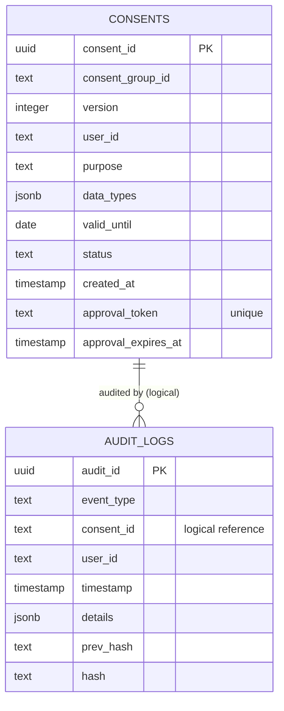

# Logical ERD
---
Artefact-ID: CMP-SM-ERD-LOGICAL
Title: Logical ERD
Version: 1.0
Status: ACTIVE
Effective-Date: 2026-02-02
Supersedes: (none)
Authoritative: true
Change-Control: ADR-0000
Source-Basis: backend/db/snapshots/schema_full_v1.sql (DB schema snapshot); regulatory_competitive_context_inputs/dpdp_summary.md (data-model expectations)
Traceability: [DPDP-S3-Rule-1] [DPDP-S8-Rule-1]
Linked-Artefacts: artefacts/02_risk-accountability/05_audit-logging/05-1-audit_logging_spec_authoritative.md; artefacts/03_system-model/10-2-consent_artefact_schema.json; artefacts/01_legal-conceptual/01-consent_taxonomy_authoritative.md
Review-Cadence: Annual
Owner: TBD
---

## Cross-Links
- Audit schema and chaining: → Ref: 02_risk-accountability/05_audit-logging/05-1-audit_logging_spec_authoritative.md
- Consent artefact target schema: → Ref: 03_system-model/10-consent_artefact_schema.json

## Purpose
Document the logical data model as implemented in PostgreSQL.

## Entities
### Consent (`consents`)
Stores versioned consent records.

Key fields:
- `consent_id` (PK)
- `consent_group_id` (grouping)
- `version`
- `user_id`, `purpose`
- `data_types` (jsonb)
- `valid_until` (date)
- `status`
- `approval_token` (unique when present), `approval_expires_at`

### AuditLog (`audit_logs`)
Stores append-only compliance events.

Key fields:
- `audit_id` (PK)
- `event_type`
- `consent_id` (text, logical link to `consents.consent_id`)
- `user_id`
- `timestamp`
- `details` (jsonb)
- `prev_hash`, `hash`

## Mermaid ER Diagram

## Constraints & Indexes (Implemented)
- `consents`: PK on `consent_id`
- `consents`: unique constraint `approval_token_unique` on `approval_token`
- `consents`: partial unique index `uniq_active_consent_per_purpose` enforcing single ACTIVE
- `audit_logs`: PK on `audit_id`
- `audit_logs`: trigger preventing UPDATE/DELETE

## Notes
- There is no foreign key from `audit_logs.consent_id` to `consents.consent_id` because `consent_id` is stored as text and sometimes set to `"UNKNOWN"`.

## Source Anchors
- `backend/db/snapshots/schema_full_v1.sql`
