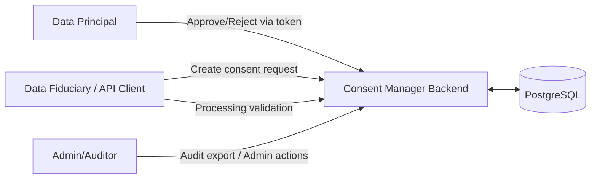

# Data Flow Diagrams (DFD) Level 0 & Level 1
---
Artefact-ID: CMP-SM-DFD-L0-L1
Title: Data Flow Diagrams (DFD) Level 0 & Level 1
Version: 1.0
Status: ACTIVE
Effective-Date: 2026-02-02
Supersedes: (none)
Authoritative: true
Change-Control: ADR-0000
Source-Basis: backend/src/routes/consentRoutes.ts (implemented endpoints); regulatory_competitive_context_inputs/dpdp_summary.md (data-flow and evidence linkage expectations)
Traceability: [DPDP-S2-Rule-1] [DPDP-S3-Rule-1] [DPDP-S6-Rule-1] [DPDP-S8-Rule-1]
Linked-Artefacts: artefacts/04_execution-layer/15-api_semantic_contract_authoritative.md; artefacts/02_risk-accountability/05_audit-logging/05-1-audit_logging_spec_authoritative.md; artefacts/03_system-model/09-consent_state_machine_spec_authoritative.md; artefacts/04_execution-layer/13_sops/13-2-sop_withdraw_consent_authoritative.md
Review-Cadence: Annual
Owner: TBD
---

## Cross-Links
- API semantics: → Ref: 04_execution-layer/15-api_semantic_contract_authoritative.md
- Audit evidence: → Ref: 02_risk-accountability/05_audit-logging/05-1-audit_logging_spec_authoritative.md
- State transitions: → Ref: 03_system-model/09-consent_state_machine_spec_authoritative.md

## Purpose
Provide DFDs grounded in implemented endpoints, tables, and actors.

## DFD Level 0 (Context Diagram)


Notes:
- The DP interaction is represented by token-based endpoints; the UI channel is out-of-scope in this repo.

## DFD Level 1 (Decomposition)
```mermaid
flowchart TB
  subgraph Actors
    DF[Data Fiduciary / API Client]
    DP[Data Principal]
    ADMIN[Admin/Auditor]
  end

  subgraph CMP[Consent Manager Backend]
    C1[Consent Request Handler\nPOST /consents]
    C2[Approval Handler\nPOST /consents/approve/:token]
    C3[Rejection Handler\nPOST /consents/reject/:token]
    C4[Revoke Handlers\nPOST /consents/:id/revoke\nPOST /consents/revoke]
    C5[Processing Check\nPOST /process]
    C6[Audit Export\nGET /audit]
    C7[Admin Force Expire\nPOST /admin/consents/:id/expire]
    C8[Expiry Job\nexpireDueConsents + cron]
  end

  DB[(PostgreSQL\nconsents, audit_logs)]

  DF --> C1
  DP --> C2
  DP --> C3
  DF --> C4
  DF --> C5
  ADMIN --> C6
  ADMIN --> C7

  C1 --> DB
  C2 --> DB
  C3 --> DB
  C4 --> DB
  C5 --> DB
  C6 --> DB
  C7 --> DB
  C8 --> DB

  C1 -->|recordAudit| DB
  C2 -->|recordAudit| DB
  C3 -->|recordAudit| DB
  C4 -->|recordAudit| DB
  C5 -->|recordAudit| DB
  C7 -->|recordAudit| DB
  C8 -->|recordAudit (job path only)| DB
```

## Out-of-Scope Required Flows
From DPDP/NeGD summaries (not implemented in repo):
- Notice presentation and proof capture
- Multi-language UI
- Grievance workflows
- Export to PDF/CSV
- Data sharing relay / transfer logging

## Source Anchors
- Routes: `backend/src/index.ts`, `backend/src/routes/consentRoutes.ts`
- Jobs: `backend/src/jobs/expireConsentsJob.ts`
- DB schema: `backend/db/snapshots/schema_full_v1.sql`
- Context inputs: `regulatory_competitive_context_inputs/dpdp_summary.md`, `regulatory_competitive_context_inputs/negd_brd_summary.md`
